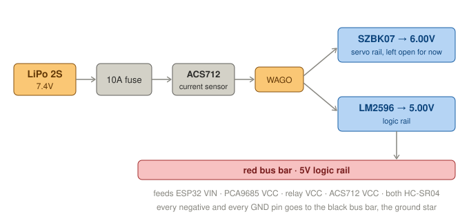
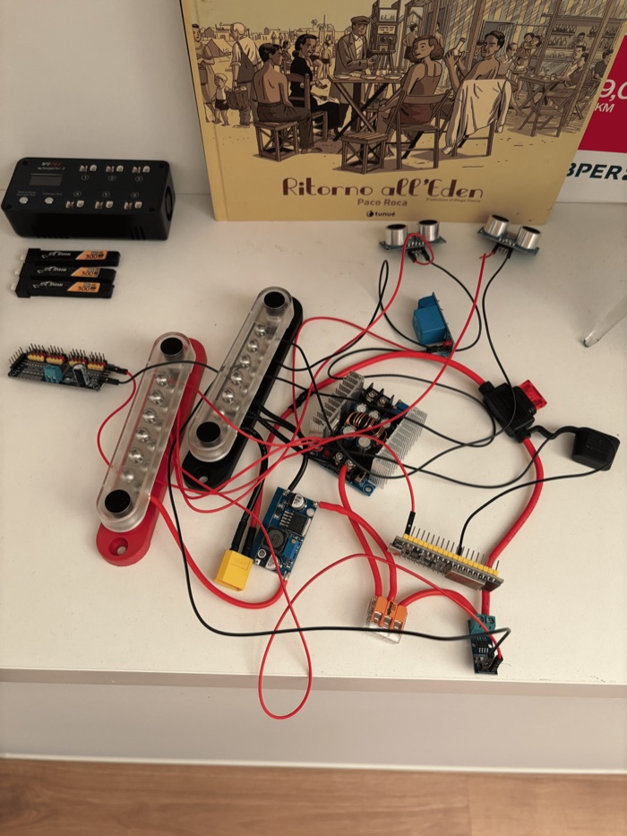

# Session 01 — Full Rewiring from Scratch

**Date:** April 12, 2026

## What I did

The previous wiring was a complete mess — a cascade of WAGO connectors chained together across all power and logic lines, with no clear structure and several known electrical errors. I decided to scrap everything and start from scratch with a cleaner, more reliable approach.

The main change was replacing the WAGO cascade with two DaierTek bus bars: one black for the common ground (GND star), one red for the 5V logic rail. This gives every component a single, solid connection point instead of a fragile chain.

I started by connecting the LiPo negative directly to the black bus bar, then ran the positive through a 10A fuse into the ACS712 current sensor. From the ACS712 output I used a WAGO (justified here — just splitting one line into two) to feed both the SZBK07 step-down (6V for servos) and the LM2596 step-down (5V for logic). Both negative inputs went to the black bus bar.

*The power path built in this session. The SZBK07's 6V output stays unconnected until the servo rail
exists. The full wiring as it stands today is in the
[wiring diagram](https://dnlsdn.github.io/KalebV2/wiring/).*

Before connecting anything else downstream, I verified the output voltages with a multimeter and trimmed both regulators: LM2596 to exactly 5.00V, SZBK07 to exactly 6.00V.

Then I connected the LM2596 output to the red bus bar and started feeding all logic components from there: ESP32 (via VIN pin), PCA9685 (VCC only — V+ left disconnected intentionally, servos not powered yet), relay module (VCC only — control pins left for later), ACS712 (VCC), and both HC-SR04 ultrasonic sensors (VCC). All GND pins of every component went to the black bus bar.

I used AWG14 for the power path and Dupont cables for all logic connections.

## What I fixed compared to before

- The PCA9685 V+ was previously disconnected — servos were never actually powered. Not fixed yet in this session, but planned for the next one via the relay.
- The HC-SR04 ECHO pins were connected directly to ESP32 GPIOs at 5V. The ESP32 tolerates max 3.3V — this could have damaged it. Voltage dividers (2kΩ/1kΩ) still need to be added, planned for a future session.
- The old WAGO cascade on the power rail has been replaced with the bus bars.

## Current state

Power path and 5V logic rail are fully wired and verified. The 6V servo rail via relay, the I2C bus, signal pins, and servo connections are all still to be done in the next sessions.

*The bench at the end of the session, with the two bus bars in the middle.*

