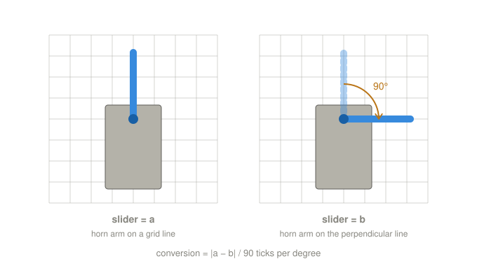
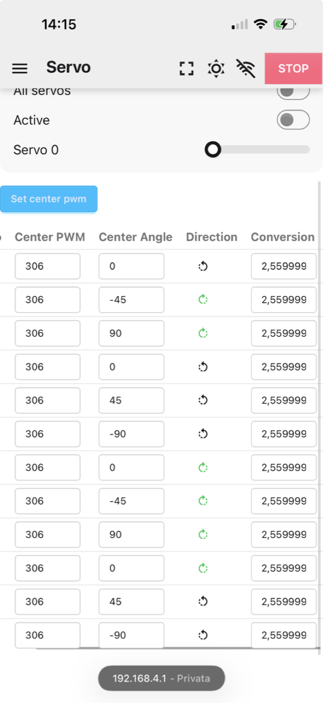

# Session 14 — Servo Conversion, Measured on a Spare

**Date:** October 3, 2026

## What I set out to do

Calibrate the servos in Leika's "servo frame" before touching the legs: find how many PCA9685 ticks
make one degree on an MG996R, on a spare servo off the robot, and copy the value to all twelve
channels. The per-joint offsets on the assembled robot (the "body frame") are the next session.

## Why on a spare, with every leg servo unplugged

Read in Leika's code and in its calibration discussion (#118) before starting:

- **The app's "Active" switch moves every channel at once.** `activate()` wakes the PCA9685 and puts
  the controller in angle mode, which sends all twelve channels to the computed pose. Leika's author
  says the same in #118: servos cannot be activated one by one, so disconnect all but the one being
  calibrated.
- **The PWM slider only reaches channels 0 to 11**, so the spare could not go on a free channel 12-15.
- **Leika's procedure drives a servo to the ends of its travel** to find min and max. On a joint with
  its horn on a leg, that means into the chassis.

So: all twelve leg servos unplugged from the PCA9685 (labelled with their channel first), a spare
MG996R with a horn on channel 0, a squared sheet under it, USB off and the ESP32 on the pack.

## What I actually did

- **The first "spare" was one of the two failed servos.** It held its position when activated but
  did not follow the slider. Swapped with the XT60 unplugged, and labelled as faulty. The real spare
  turned on activation and followed the slider.
- **The minimum could not be found.** The servo still moved at 80 ticks, the lowest value the app's
  slider allows. Leika's min/max procedure only serves to derive a starting centre, and the centre is
  replaced joint by joint in the body frame anyway, so it was dropped rather than worked around.
- **The conversion was measured directly, with the grid of the sheet as the protractor.** Servo body
  squared to the grid, horn arm laid on a grid line, slider value noted; then the slider moved until
  the arm lay on the perpendicular line, a quarter turn.

*Two marked points are not enough: how far the horn's hole travels on the paper depends on how far it
sits from the shaft. The arm's direction against the grid gives 90° with no protractor and no
measurement of the arm.*

| Arm on | Slider value |
|---|---|
| perpendicular line, one side | 130 |
| reference line | 349 |
| perpendicular line, other side | ~590 |

- 130 → 349, 90°: **2.43** ticks per degree.
- 349 → 590, 90°: **2.68** ticks per degree.
- 130 → 590, 180°: **2.56** ticks per degree.

The two halves differ by 10%, more than lining an arm up by eye explains (about ±4% on 90°), so the
servo is probably not linear across its travel — it stretches towards the high end. **2.56**, over the
whole 180°, is the value used: it halves the reading error and sits within 5% of both halves.

**Leika's default is 2.0.** With it, every commanded movement would have come out about a fifth short:
45° asked, about 37° done. This is consistent with another builder's report in #118 that MG996R-180s
turn about 158° across their range, but that link is an inference, not a measurement.

**2.56 entered in the Conversion column of all twelve rows** of Leika's servo table, saved, and read
back after reloading the page: every row shows 2.559999, the float nearest to 2.56. Center PWM (306),
Center Angle and Direction were left at Leika's defaults.

*The servo table read back from the ESP32 after a reload. Conversion is the only column changed; the
others are the next session.*

## What I verified

| Measurement | Reading |
|---|---|
| PCA9685 V+ ↔ black bus bar, spare servo connected, pack in | **6.0V** |

## What is still open

- **The leg servos were unplugged and plugged back by channel label.** The map has not been checked
  with Leika yet; the first activation next session will show any swap.
- **The first activation with all twelve will be larger than the session 13 desk check predicted**,
  because that check assumed a conversion of 2.0. Redo it with 2.56 before powering the legs.
- **The settings live in the ESP32's filesystem** (`servoSettings.json`), not in the code. Uploading the
  filesystem image again would erase them; they are recorded here and in `firmware/leika-config.md`.
- **One of the two failed servos holds but does not move.** It stays out of the robot.
