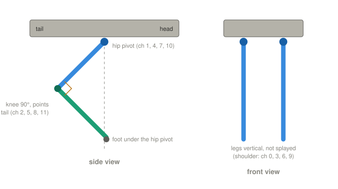
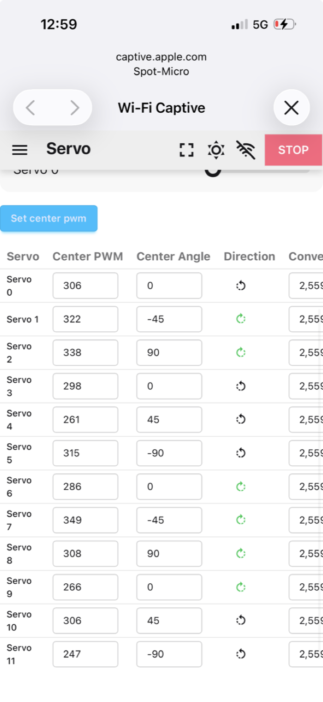
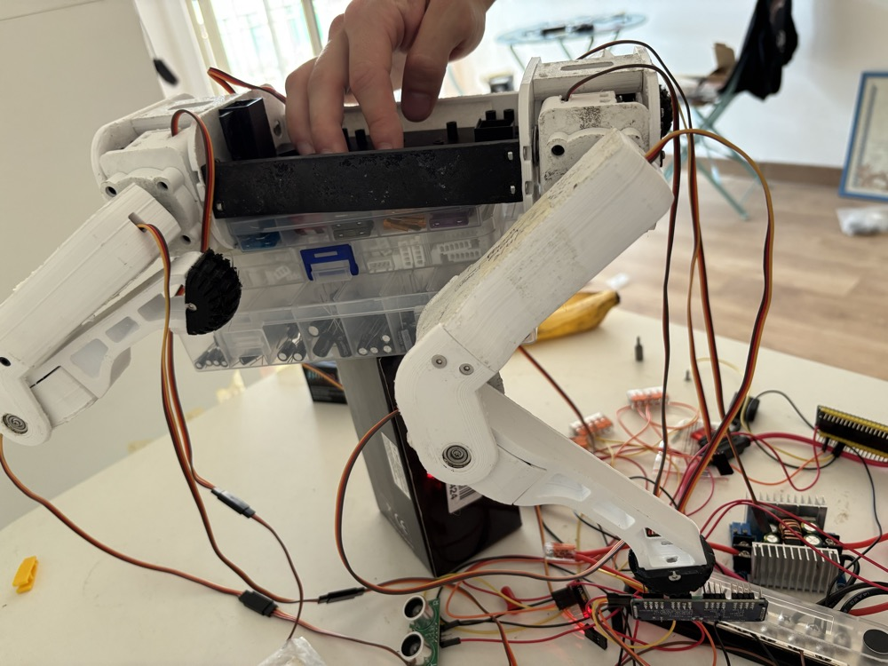
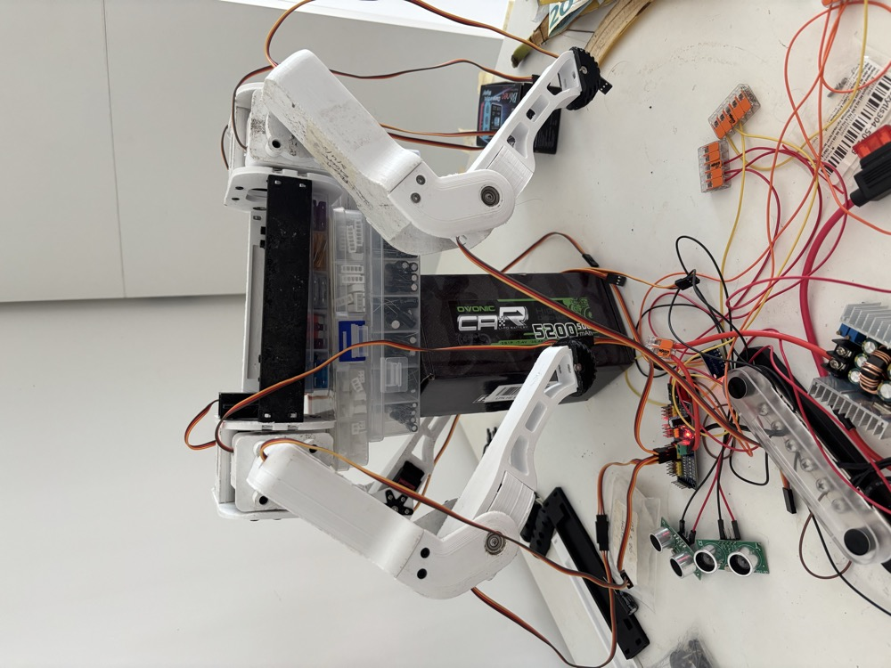
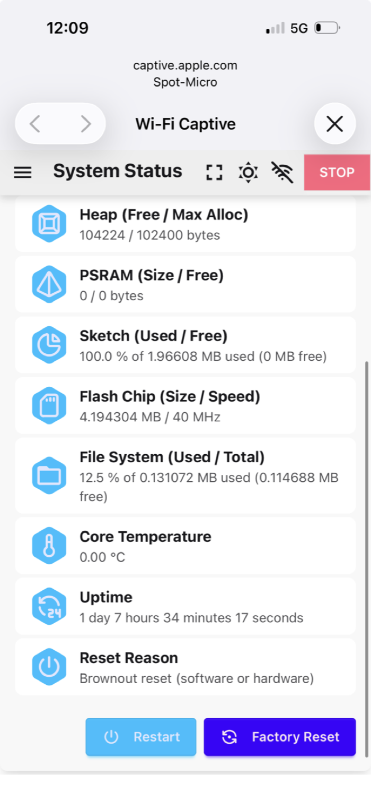

# Session 15 — Body Frame Calibration

**Date:** October 4, 2026

## What I set out to do

Find the Center PWM of each of the twelve joints: the pulse at which that joint sits where Leika's
geometry expects it. Session 14 measured how many ticks make a degree, the same for every MG996R.
Where each joint's zero is depends on how its horn went onto the spline, so it is measured joint by
joint.

## Read before starting

**Leika's calibration documentation is out of date.** Discussion #118 (January 2025) says Calibration
mode holds every leg pointing straight down. In the version flashed here, choosing Calibration sends
the motion state to `nullptr`, and the firmware then **deactivates** the servos. That procedure no
longer exists.

**What the "Active" switch on the Servo page does.** It sends every connected servo to the angles held
in memory, which at boot are all zero — for Leika, **legs straight down**. Every joint can move up to
about 90°, all at once.

**What Center PWM means.** Leika computes `pwm = (direction × angle + center_angle) × conversion +
center_pwm`. With the default Center Angles, `center_pwm` is the pulse at the pose where Leika's
inverse kinematics puts the **knee at 90° and the foot straight under the hip pivot**, with the leg
vertical seen from the front. Worked out from the formulas and `kinematics.h`, not from documentation.

*The pose each joint's Center PWM is measured at. The thigh slopes back about 45°, because thigh
(111mm) and lower leg (118.5mm) are nearly the same length.*

**The app's "Set center pwm" button** stores the PWM slider's current value as the Center PWM of the
selected servo.

## How

**One leg at a time, only its three servos plugged in.** Activation then moves three servos, not
twelve, and each channel is checked against its joint as it is calibrated. For each leg:

1. XT60 out, plug the leg's three channels, XT60 in, Servo page, **Active** on: the leg goes straight.
2. **Shoulder** first: slider until the leg hangs vertical seen from the front. Set center pwm.
3. **Knee** next: slider until the angle between thigh and lower leg is 90°, checked with the corner of
   a sheet. It does not depend on the thigh. Set center pwm.
4. **Thigh** last: slider until the foot is under the pivot at the top of the thigh, checked side-on
   with a plumb line. Set center pwm.

The PWM slider shows its own position, not the servo's. Touching it far from where the servo is makes
the servo jump there, so each joint started from the value the straight pose had sent it to.

**Check on the front left leg.** Deactivating and reactivating sends the leg back to straight, now
computed with the new centres. Knee straight and leg vertical: that is a 90° move of the knee from
its reference, so it confirms the conversion of session 14 too.

**The right knees cannot go straight.** Leika clamps every pulse to 125-600. A right knee's straight
pose falls near 70-80, so it stops at 125, bent by about 15°. Harmless — a knee is never straight when
walking — but the straight-leg check only works on the left side.

## The values

| Ch | Joint | Center PWM | From 306 |
|---|---|---|---|
| 0 | front left shoulder | 306 | 0° |
| 1 | front left thigh | 322 | +6° |
| 2 | front left knee | 338 | +12° |
| 3 | front right shoulder | 298 | −3° |
| 4 | front right thigh | 261 | −18° |
| 5 | front right knee | 315 | +4° |
| 6 | rear left shoulder | 286 | −8° |
| 7 | rear left thigh | 349 | +17° |
| 8 | rear left knee | 308 | +1° |
| 9 | rear right shoulder | 266 | −16° |
| 10 | rear right thigh | 306 | 0° |
| 11 | rear right knee | 247 | −23° |

Degrees at 2.56 ticks per degree. **Nine of twelve joints are 4° or more off Leika's default**, up to
23°. At the knee, 12° moves a standing foot up or down by about 1.8cm, and 6° at the thigh moves it
about 1.7cm forwards or back.

*The table read back from the ESP32 after all twelve were saved.*

**The front right thigh was first read as 384**, 30° off. A side photo showed the thigh vertical and
the foot about 12cm in front of the hip: the plumb line had been held at the knee. Corrected to 261.
The rear right knee, at 247 the furthest from 306, was checked the same way before it was kept.

*Front right leg at its corrected centres. The head is to the right.*

*Both rear legs at their centres: the right one (left in the photo) at 266 / 306 / 247, the left one
already calibrated. They should look like mirror images, and they do.*

## What I verified

- **Every channel moved its own joint**: the twelve servo cables were re-plugged by label in session 14
  and this was the first check.
- **The front left leg, re-activated at its new centres, went straight and vertical.**
- **The values survive a reload of the app**, read back from the ESP32 (screenshot above).

No multimeter readings: nothing on the power path changed.

## What is still open

- **The ESP32 resets from brown-out.** The connection kept dropping while servos moved. It looked like
  the Wi-Fi alone, because the leg stayed stiff — but these servos stay stiff with no pulses too, so
  that test proved nothing. Leika's System Status page settled it: **Reset Reason: Brownout reset**.
  Its Uptime read "1 day 7 hours", which is a Leika bug: the firmware sends milliseconds
  (`esp_timer_get_time() / 1000`) and the app formats them as seconds; the real figure was 113 seconds.
  With three servos moved one at a time this is a nuisance. Standing or walking, a reset mid-step drops
  the robot. **Next session.**

  

- **Deactivating does not make the servos limp.** With Active off, and with the PCA9685 asleep and no
  pulses, the leg stayed stiff. Most likely the MG996R holds its last position when its signal stops,
  as many digital servos do — not verified. Either way, the **STOP button and Deactivated are not a
  safe state; only unplugging the XT60 is.**
- **The calibration is static.** No pose has been commanded through Leika's kinematics yet. Rest with
  the robot lifted comes after the brown-out is fixed.
- **The failed servo** from session 14 stays out of the robot.
