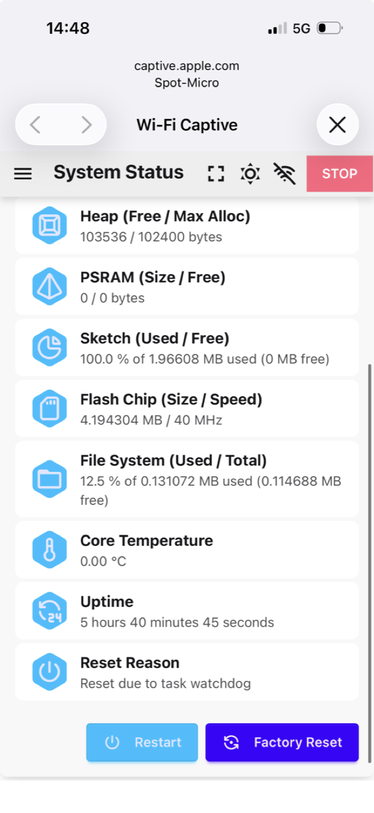
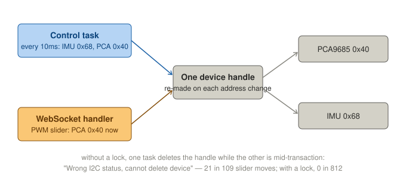

# Session 16 — ESP32 Resets, an I2C Race, and a Lost Board

**Date:** October 4, 2026

## What I set out to do

Find why the ESP32 reset during session 15, when Leika's System Status reported a brown-out, before
anything asks twelve servos to stand.

## What I actually did

**The first reading was not a brown-out.** With the pack connected and no servo moving, System Status
said *Reset due to task watchdog*, about 20 seconds after the board had restarted on its own (Leika's
Uptime is in milliseconds read as seconds, see `firmware/leika-config.md`). A task watchdog reset means
a firmware task stopped responding — software, or something software waits on, not the supply.



**The brown-out threshold makes a thin wire an unlikely cause.** Leika's configuration uses the lowest
detector level: a reset only when the ESP32's 3.3V falls below **2.43V** (ESP-IDF, `Kconfig.system`).
The regulator needs about a volt of headroom, so the 5V input would have to fall below about 3.4V —
a contact opening, or a supply collapsing, not a few hundred millivolts across a Dupont.

**USB serial logs, no pack.** On USB alone the PCA9685 and the IMU still run from the board's 3.3V, so
the firmware can be watched without the servo rail. Five minutes idle: nothing. Then the Servo page's
PWM slider, with Active off so nothing moved:

```
E (170505) i2c.master: i2c_master_bus_rm_device(1022): Wrong I2C status, cannot delete device
```

**A race on the I2C bus, in Leika.** Leika keeps one device handle for the bus and deletes and re-creates
it whenever the address changes. Two tasks use the bus: the control task (IMU at 0x68 and the PCA9685
at 0x40, every 10ms) and the WebSocket handler, which writes the PCA9685 at once when the PWM slider
moves. Nothing stops one from deleting the handle while the other is mid-transaction. A transaction
left half-done can stall the task that owns it — which is what a task watchdog catches.



**Fixed with a lock**: a recursive mutex around every transaction in `i2c_bus.h`, the seventh change
to Leika.

| Firmware | PWM slider moves | "Wrong I2C status" | Resets |
|---|---|---|---|
| before | 109 | **21** | 0 |
| after | **812** | **0** | 0 |

The task watchdog reset itself was not seen again, before or after the fix. The race is its most
likely cause, not a proven one.

**The pack again, for the brown-out.** Reset Reason after connecting: *power-on*, as expected. Wiggling
the ESP32's VIN and GND Duponts at both ends: no drop. Static readings: **4.97V on the ESP32's VIN pin,
5.00V on the bar**, 30mV across the Duponts at idle.

**Then the board was lost.** The VIN reading was taken with both probes on the ESP32's header. The
Wi-Fi vanished while the probes were there and did not come back; the board's power LED went out, with
the bars still at 4.99V. A GND Dupont had also come off the black bar. On USB alone, then with all five
Duponts removed, the LED stayed off and the chip did not answer `esptool chip_id`, while the Mac still
saw the CP2102. The board's 3.3V is gone. The likely cause is a probe slipping onto a neighbour of the
5V pin — on DevKitC-style boards that is the flash's CMD line, rated for 3.3V — but that is not
verified.

## The ESP32's wires, for the replacement

The board is out of the robot. Its five Duponts, by colour:

| Wire | From | ESP32 pin |
|---|---|---|
| red | red bus bar, 5V | VIN (5V) |
| red | 3.3V WAGO | 3V3 |
| black | black bus bar | GND |
| yellow | SDA WAGO | GPIO21 |
| orange | SCL WAGO | GPIO22 |

**Replacement:** ESP-WROOM-32 boards with 4MB flash and a CP2102, the same as the lost one — chosen as
a 3-pack from ELEGOO, one for the robot and two spares. They have **30 pins**; whether the lost board
had 30 or 38 was never recorded. The five pins used exist on both layouts, so the wiring is unchanged;
the labels may read D21/D22 and the board's footprint may differ on the circuitry plate.

**The calibration is in the firmware now.** It lived in the lost board's filesystem. The eighth change
to Leika writes the conversion and the twelve Center PWMs as Leika's defaults, which it uses whenever
the filesystem has no servo settings — a new board, or an erased filesystem.

## What I verified

| Measurement | Reading |
|---|---|
| ESP32 VIN pin ↔ GND, pack in, idle | 4.97V |
| Red bus bar ↔ black bus bar, same moment | 5.00V |
| Red bus bar ↔ black bus bar, after the board went dark | 4.99V |

## What is still open

- **The brown-out of session 15 is not explained.** The race cannot cause it: the brown-out detector is
  hardware. It is tested again on the new board, with the pack, and the servos moving.
- **The PCA9685 and the IMU** were on the lost board's 3.3V. An I2C scan on the new board shows whether
  they survived.
- **A measuring rule, now a safety gate:** black probe on the black bus bar, red probe on one pin.
  Never two probes on adjacent header pins.
