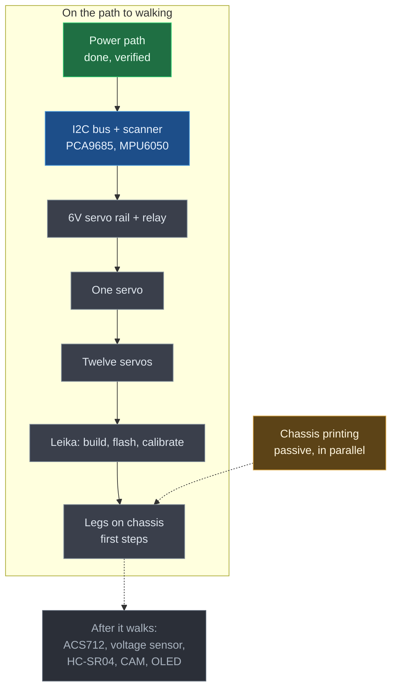

# Session 03 — The Session That Deleted Four Phases

**Date:** August 14, 2026

## What I set out to do

Build the voltage dividers on the HC-SR04 ECHO lines, as session 2 had planned. I had the
resistors, I was at the bench, the battery was disconnected and the rail measured 0V.

I never soldered anything, and that is the point of this session.

## What actually happened

The dividers turned into a question about the perfboard, the perfboard turned into a question about
whether the resistors were needed at all — the guides I had read never showed either — and that
turned into the question I had never asked in three sessions: **why am I wiring the ultrasonic
sensors now?**

So instead of building, I went and read the reference project properly.

## What I found out

**The project this repository is based on has no software.** The README of
[SpotMicroESP32 by michaelkubina](https://github.com/michaelkubina/SpotMicroESP32) says the project
lacks the whole programming part. It is a mechanical and electrical design. Its `code/` directory
holds test sketches and links to community forks, not a firmware.

Following it to the letter produces a perfectly wired robot that cannot move, because the part that
moves it is not in that repository. Three sessions in, I had never checked where the movement was
supposed to come from.

**The sensors are optional, and the reference project says so.** Only the ESP32, the PCA9685, the
twelve servos and the power system are mandatory in michaelkubina's own component list. The
ESP32-CAM, MPU6050, HC-SR04, OLED, WS2812 ring, ACS712 and voltage sensor are all marked optional
and "not tested yet".

That is why no guide I had found showed a divider or a perfboard: the guides do not wire the
ultrasonic sensors as part of the base build at all. My roadmap had scheduled them as the next
session, ahead of the entire servo chain, for a subsystem whose firmware is not planned yet.

**The reference project recommends three community firmwares**, and picking one is a decision that
belongs before more wiring, not after — the firmware dictates the pinout.

- Maarten Weyn — ESP-IDF, BLE phone control. Hardest toolchain.
- Blacksheep909 Nitro-Fork — Arduino, easiest code to read, but needs a custom PCB and a FlySky
  FS-i6 RC transmitter. Hardware I do not have.
- [Leika, by runeharlyk](https://github.com/runeharlyk/SpotMicroESP32-Leika) — inverse kinematics,
  a 12-point Bezier trot and an 8-phase crawl gait, driven from a phone browser over WiFi.

**Leika is the target**, because it is the only one that requires nothing I would have to buy.

The chassis I am printing is compatible: michaelkubina publishes the leg link geometry the forks are
built around — L1 shoulder 10mm, L2 upper leg 60.5mm, L3 lower leg 111.1mm, L4 foot 118.5mm.

**A pin conflict, caught on paper.** michaelkubina assigns **GPIO27 to the relay**. My roadmap had
GPIO27 as the second sensor's ECHO. Had I built the dividers this evening as planned, I would have
had to unwire them. The relay moves to GPIO27 to match the reference project, and the pins for the
optional peripherals are deliberately left unassigned until each one is actually integrated — they
get read from Leika's configuration then. The pinout is dictated by the firmware that runs, not by a
document.

**The chassis was never on the critical path**, and it should have been from the beginning. The legs
are assembled but there is no body to attach them to. It is the longest-lead item in the project and
it is passive time — the printer works alone. It is running now, in parallel.

## What I verified with the multimeter

Nothing electrical was changed this session. The only measurements taken were the four resistors,
out of circuit, before the plan changed: 997Ω, 995Ω, 2008Ω and 1995Ω, all inside a 5% tolerance.
They went back in the drawer.

For the record, since the calculation was done and will be needed later: with the ECHO line at the
measured 4.98V of the logic rail, those pairs give 3.33V and 3.32V at the divider node. The ESP32
datasheet puts VIH at 0.75×VDD, so 2.48V, with an absolute maximum of VDD+0.3 = 3.6V on the pad.
Comfortably above the threshold, but only 0.27V below the ceiling — worth remembering if the LM2596
trimmer is ever touched.

The divider is still correct and still necessary when the sensors are eventually wired. Connecting
a 5V ECHO line straight to a GPIO, as many guides do, puts 1.4V over the absolute maximum. It
works — the pads have clamp diodes — but it is out of spec, and on a walking robot a degraded pin
becomes an intermittent fault that looks like a firmware bug.

## What changed in the documentation

`STATE.md` was rewritten around a single stated goal: make the robot walk. It now carries the
firmware decision, the reconciled pinout, and a scope section separating the path to walking from
the integrations that come after it.

A rule was added to the session rules: a session starts by asking whether the step is worth doing at
all, not just what the step is. This session exists because that question had never been asked.

`relay-off-on-safe.md` was updated from GPIO25 to GPIO27.

## What is still open

- The two servos still in delivery are not centered at 1500µs. They need a working PCA9685, so they
  cannot be done before the single-servo session.
- The relay module's contact rating has not been checked against what twelve MG996R can pull.
- Whether Leika expects the relay on GPIO27 has not been confirmed in its source. One wire either
  way.

## Current state

Unchanged on the bench: the power path is wired and verified, everything else is not. What changed
is the plan. Four phases left the critical path, the firmware has a name, and the next session is
the first one where the board does something.

Next session is the I2C bus and an I2C scanner — the safest session in the project, powered from USB
with the battery disconnected and no servo able to move.
